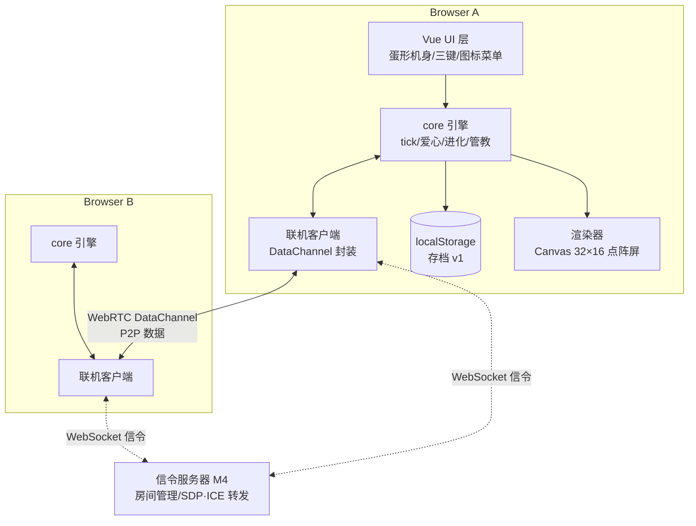
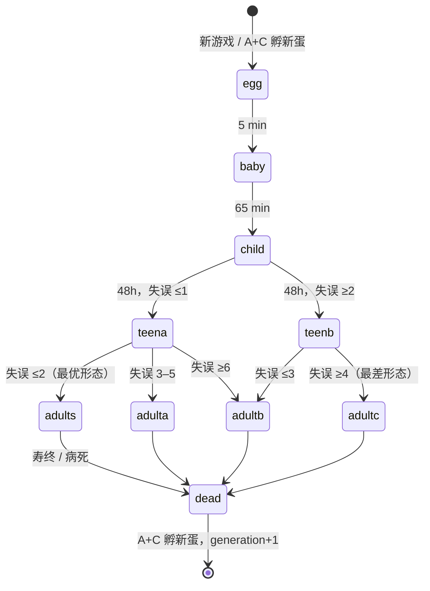
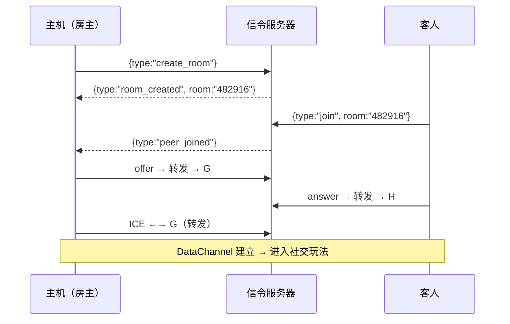

# 拓麻歌子（Tamagotchi）Web 复刻 · 开发文档

> 本文档是项目的**主控文档（Single Source of Truth）**，随开发持续更新。
> 任何架构调整、协议变更、里程碑完成状态，都必须回写到本文档。

| 项目代号 | TakuMagaKo |
|---|---|
| 当前版本 | v0.9 |
| 当前阶段 | **M1–M5 全部完成** 🎉 → 维护期（可选增量：逐帧美术 / TURN / Web Bluetooth） |
| 最近更新 | 2026-09-06 |

---

## 0. 最高指导原则

> **UI 与玩法完全仿照 1996 年初代拓麻歌子（P1）**：
> 32×16 黑白点阵屏、8 个环绕图标、A/B/C 三键、爱心制属性、猜方向小游戏、
> 管教叫唤、便便/生病/关灯睡觉、照料失误驱动进化分支、死亡变天使、A+C 孵新蛋。
>
> **美术与角色名全部原创**（不使用万代任何素材/名称）；复刻的是玩法机制而非版权内容。
> 所有玩法数值以 `packages/core/src/balance.ts` 为准，本文件是其人类可读副本。

---

## 1. 项目愿景与目标

复刻童年记忆中的拓麻歌子电子宠物，以 Web 技术从零实现一台"永远在线"的数字宠物，并赋予其原版没有的能力——**多设备联机社交**。

### 1.1 成功标准（Definition of Done）

| 维度 | 验收标准 |
|---|---|
| 养成核心 | 完整 P1 循环：孵化→喂食（正餐/零食）→游戏→排便冲洗→管教→生病打针→关灯睡觉→进化→死亡；属性以 0–4 爱心制呈现 |
| 界面体验 | 仿真度：32×16 点阵屏 + 环绕 8 图标 + 蛋形机身三键；桌面/移动浏览器均可用；动画稳定 60fps |
| 持久化 | 刷新、关闭浏览器后宠物状态完整恢复；离线期间按真实时间结算（封顶 8h） |
| 联机社交 | 两台设备通过房间号/扫码配对后，可互相拜访、赠送礼物、进行双人小游戏 |
| 工程质量 | 核心逻辑单元测试覆盖全部领域规则；联机链路有端到端测试 |

### 1.2 非目标（Out of Scope，本期不做）

- 账号体系 / 云端存档（联机仅做房间级临时配对）
- 原生 App 封装（后续以 PWA 演进）
- 使用任何万代官方美术、角色名（全部原创）

---

## 2. 技术选型

| 领域 | 选型 | 理由 |
|---|---|---|
| 构建 | **Vite 5** | 快速 HMR，生态成熟 |
| 框架 | **Vue 3 + TypeScript**（`<script setup>`，strict） | 组合式 API 利于模块化；类型安全约束协议 |
| 状态管理 | **Pinia**（M2 引入） | 宠物状态单一数据源，天然对接持久化 |
| 渲染 | **Canvas 2D** 自研轻量精灵渲染器 | 32×16 低分辨率整数倍放大 + `image-rendering: pixelated`，零依赖 |
| 游戏循环 | **固定步长 1s tick + rAF 渲染** | 逻辑与渲染解耦，`core` 无 DOM 依赖、可在 Node 下仿真 |
| 持久化 | **localStorage（MVP）→ IndexedDB（idb-keyval）** | 存档带 schema 版本号，便于迁移 |
| 联机（主方案） | **WebRTC DataChannel + WebSocket 信令服务器** | 浏览器直连 P2P；服务器只做配对，无状态 |
| 联机（备选/实验） | Web Bluetooth API | iOS Safari 不支持 → M5 后评估，传输层以 `Transport` 接口预留 |
| 信令服务 | **Node.js + ws** | 房间管理 + SDP/ICE 转发（M4 实现） |
| 二维码 | `qrcode` 生成 + `BarcodeDetector`/`jsqr` 识别 | 扫码进房 |
| 测试 | **Vitest**（单元，注入时钟+种子 RNG 保证确定性）+ **Playwright**（E2E，双上下文测联机） | — |
| 包管理 | pnpm workspace | `apps/web` + `apps/signaling`(M4) + `packages/core` + `packages/protocol` |

### 2.1 关键技术决策（ADR）

- **ADR-01｜真实时间驱动**：属性随现实时间衰减；离线重开按时长结算，**封顶 8h**，防止长时间不玩直接死亡。
- **ADR-02｜逻辑与渲染分离**：`packages/core` 纯 TS（无 DOM），UI/渲染/联机均可替换；Node 仿真脚本做数值验收。
- **ADR-03｜WebRTC 为主、蓝牙为辅**：蓝牙浏览器兼容性差，不满足普及性目标。
- **ADR-04｜信令服务器不存用户数据**：房间即瞬态配对通道，配对成功后纯 P2P。
- **ADR-05｜存档 schema 版本化**：`save.v = 1` 起，每次结构变更写迁移函数，**禁止静默丢档**。
- **ADR-06｜玩法与 UI 完全仿初代 P1**：爱心制（0–4）而非百分比属性；无体力/清洁度数值条；快乐只通过游戏与零食恢复（原版没有"抚摸"）；美术原创。

---

## 3. 系统架构

### 3.1 总体架构



### 3.2 仓库结构（pnpm monorepo，已落地）

```
takumagako/
├── apps/
│   ├── web/               # Vite + Vue 前端（M1 调试台已接线；M2 替换为仿原版 UI）
│   └── signaling/         # 信令服务器（M4 创建）
├── packages/
│   ├── core/              # ✅ 领域引擎（无 DOM，可单测/仿真）
│   │   ├── src/types.ts      # PetState / PetEvent（爱心制模型）
│   │   ├── src/balance.ts    # 全部玩法数值（唯一权威来源）
│   │   ├── src/rng.ts        # mulberry32 种子随机
│   │   ├── src/pet.ts        # createPet
│   │   ├── src/lifecycle.ts  # 孵化/进化树/作息/死亡
│   │   ├── src/engine.ts     # 1s 固定步长 tick + 离线结算（封顶 8h）+ 时间回拨保护
│   │   ├── src/actions.ts    # 正餐/零食/冲洗/打针/灯/管教/猜方向/rebirth
│   │   ├── test/             # 26 个确定性单测
│   │   └── sim/run.ts        # 18 天仿真验收脚本（pnpm sim）
│   └── protocol/          # ✅ 联机消息 zod schema（M4 接入传输层）
├── 开发文档.md             # ← 本文档
└── pnpm-workspace.yaml
```

### 3.3 前端目标结构（M2 起演进 `apps/web/src/`）

```
apps/web/src/
├── renderer/screen.ts     # 32×16 逻辑屏 → Canvas 整数倍放大
├── renderer/sprite.ts     # 精灵帧动画
├── ui/DeviceShell.vue     # 蛋形机身（糖果色、挂链孔）
├── ui/LcdScreen.vue       # 点阵屏 + 环绕 8 图标
├── ui/ControlButtons.vue  # A/B/C 三键（触屏 + 键盘 Z/X/C）
├── ui/screens/            # 主页/喂食/游戏/状态页/医疗/管教 等屏内画面
└── stores/pet.ts          # Pinia：core 状态 ↔ 响应式桥
```

---

## 4. 核心领域模型（仿 P1）

### 4.1 宠物状态（`PetState`，已实现于 `packages/core/src/types.ts`）

| 字段 | 说明 |
|---|---|
| `stage` | `egg / baby / child / teen / adult / dead` |
| `characterId` | 进化形态：`baby → child → teen-a/b → adult-s/a/b/c`，死亡为 `angel` |
| `hungerHearts` / `happinessHearts` | **0–4 颗爱心**（仿原版心形计量） |
| `disciplinePct` | 管教度 0–100%，每次有效管教 +25% |
| `weightG` | 体重（克）：正餐 +1、零食 +2、游戏胜利 −2，下限为阶段基线 |
| `ageYears` | 每真实 24h 长 1 岁 |
| `poops` | 场上便便 0–3；≥2 堆持续 30 分钟 → 生病 |
| `sick` / `sickSince` | 生病状态；**3 小时不治 → 死亡** |
| `sleeping` / `lightsOff` | 按作息表自动入睡；**整夜不关灯 → 照料失误** |
| `attention` | `none / need / discipline-call`（attention 图标亮 + 哔哔叫） |
| `careMistakes` | **照料失误累计数 —— 驱动进化分支与寿命的核心** |

### 4.2 数值表（与 `balance.ts` 同步）

| 阶段 | 饱食衰减 | 快乐衰减 | 排便间隔 | 作息 | 体重基线 |
|---|---|---|---|---|---|
| baby | 1 心 / 12 min | 1 心 / 15 min | ~60 min | 20:00–09:00 | 5g |
| child | 1 心 / 45 min | 1 心 / 60 min | ~150 min | 21:00–09:00 | 10g |
| teen | 1 心 / 60 min | 1 心 / 75 min | ~180 min | 21:00–09:00 | 15g |
| adult | 1 心 / 90 min | 1 心 / 90 min | ~180 min | 21:00–09:00 | 20g |

- 排便间隔带 ±20% 随机抖动；**睡眠中需求暂停，但病程继续**。
- **照料失误**触发：爱心归零持续 30 min（每种每段记一次）／整夜不关灯／管教叫唤 15 min 无人理／便便堆积溢出（>3）。
- **成长时长**：卵 5 min → baby 65 min → child 48h → teen 72h → adult。
- **寿命**：adult 基础 10 天，每次失误折寿 12h，最短 5 天 → 寿终（old-age）。

### 4.3 进化树（仿 P1 growth chart）



（`teen-a/b`、`adult-s/a/b/c` 为内部代号；M5 配原创像素形象与名字。）

### 4.4 情绪与叫唤

- **attention 图标 + 哔哔声**：爱心归零／生病 → `need` 叫唤；child 起每 3–6h 随机**无理取闹**（`discipline-call`）→ 需要管教，15 min 无人理记失误。
- **屏内表情**：饥饿（张嘴叫）/ 不开心（背对）/ 生病（骷髅头闪烁）/ 睡觉（ZZZ）/ 死亡（天使+光环），M2 以 2 帧像素动画呈现。
- **文字气泡**（Web 增强，不破坏屏内仿真）：以气泡文案旁白情绪，冷却 30s。

---

## 5. 游戏循环（Tick Engine，已实现）

1. **固定步长**：逻辑 tick = 1s，rAF 仅驱动渲染；低性能/后台标签页不掉逻辑。
2. **离线结算**：启动时 `now − updatedAt` 按秒批量结算，**封顶 8h**；UI 弹"你不在的时候发生了…"摘要（M3）。
3. **时间来源**：一律 `Date.now()`；**时间回拨保护**（now < updatedAt 时不结算，锚点单调）。
4. **死亡即冻结**：死亡后不再衰减，等待 A+C。

### 5.1 玩家动作（已实现于 `actions.ts`，均含仿原版门禁）

| 动作 | 规则 |
|---|---|
| 🍚 正餐 | +1 饱食心、+1g；饱了摇头拒绝；生病/睡觉/卵期不可用 |
| 🍬 零食 | +1 快乐心、+2g；**连续 3 次只吃零食 → 牙痛生病** |
| 🚽 冲洗 | 清空便便；无便拒绝 |
| 💉 打针 | 生病时单次 80% 治愈（可能需补针）；健康时拒绝 |
| 💡 灯 | 手动开关；睡眠中关灯可免除失误；天亮自动开 |
| 👋 管教 | 仅无理取闹叫唤时有效，+25% 管教度 |
| 🎮 猜方向 | 5 局猜左/右，赢 ≥3 → 快乐 +2 心、体重 −2g；输 → +1 心；baby 不会玩 |
| 🥚 rebirth | 死亡后 A+C：generation+1 回到蛋 |

---

## 6. UI / UX 设计（完全仿 P1）

### 6.1 屏幕与图标

- **LCD**：32×16 逻辑像素、1-bit 黑白；角色 16×16 居中，2 帧待机摆动；整数倍放大（×10 起）+ `image-rendering: pixelated`。
- **8 个环绕图标**（原版的 LCD 段，Web 版用 DOM/SVG 模拟，选中态反色）：
  - 上排：🍚 喂食 ｜ 💡 灯 ｜ 🎮 游戏 ｜ 💉 医疗
  - 下排：🚽 冲洗 ｜ 📊 状态 ｜ 👋 管教 ｜ 📢 注意（仅指示不可选）
- **屏内画面**：主页（宠物待机）/ 喂食子菜单（正餐·零食）/ 游戏（左右箭头 + 宠物转身）/ 状态分页（年龄·体重 → 管教度 → 饱食心 → 快乐心）/ 医疗（针管）/ 便便与骷髅头等场景物件。

### 6.2 三键操作（忠于原版手感）

| 键 | 通用 | 屏内 |
|---|---|---|
| **A**（左） | 移动图标光标 | 选项上/左；游戏中猜"左" |
| **B**（中） | 确认/进入 | 确认；游戏中猜"右" |
| **C**（右） | 取消/返回主页 | 取消 |
| **A+C** | 死亡后孵新蛋 | — |

- 移动端：三个大圆键（拇指热区）；桌面端同时支持键盘 `Z/X/C`。
- 叫唤时 attention 图标闪烁 + 方波哔哔声（WebAudio，可静音）。

### 6.3 机身与响应式

- 蛋形机身：糖果色塑料质感（CSS 渐变+噪点）、挂链孔装饰；配色可选（粉/蓝/黄，M5）。
- **移动**（<480px）：机身竖向占满，三键加大；**桌面**：机身居中，两侧为存档/联机卡片。
- 文字气泡等 Web 增强元素一律**在屏外**，屏内保持 100% 原版仿真。
- **局域网访问**（v0.5 起）：Vite `server.host`/`preview.host` 已开放，`pnpm dev` 后同一 Wi-Fi 下的手机/平板直接访问 `http://<本机IP>:5173`（dev 服务启动时会打印 Network 地址）。

---

## 7. 像素资源方案

| 资源 | 规格 | 数量 | 制作方式 |
|---|---|---|---|
| 角色精灵 | 16×16，每形态 待机2/进食2/开心2/生病2/睡觉1 帧 | 8 形态 ≈ 70 帧 | 先代码绘制占位矩阵，M5 换 Aseprite 正式美术 |
| 屏内物件 | 便便/饭碗/糖果/针管/骷髅/天使/Zzz | ~10 件 | 代码绘制 |
| 图标 | 8×8 | 8 枚 | 代码绘制 |
| 音效 | 方波 beep（叫唤/按键/胜利） | 3–5 种 | WebAudio 程序化（M5） |

**策略**：占位资源由 `renderer/sprite.ts` 统一加载，正式美术替换零成本。

---

## 8. 联机系统设计（M4，协议 schema 已就绪）

### 8.1 方案概览

- **配对层**：WebSocket 信令服务器，6 位数字房间号 / 扫码（**v0.7 实现注记**：Web 端二维码内容为 `${页面URL}?room=<房号>`，扫码/点链接自动加入；`takumagako://` 自定义 scheme 不适用于 Web，已弃用）。
- **数据层**：配对后 WebRTC DataChannel 纯 P2P；公共 STUN；失败给明确提示（TURN 列为后续可选项）。
- **信令实现**：`apps/signaling`（ws + tsx，端口 8787，`GET /health` 健康检查）；转发 offer/answer/ice，不读业务内容；房间规则见 `room.ts`（单测覆盖）。
- **协议**：`packages/protocol`（zod schema）：应用层 `NetMsg` + 信令层 `SignalMsg`，均正/反例单测；**猜拳 commit-reveal 防作弊**；协议只传"事件"，双方在各自本地引擎独立结算并做合法性检查。
- **社交状态**：拜访冷却等暂存 `takumagako-net-v1`（M5 并入 SaveFile stats）。

### 8.2 配对时序



### 8.3 联机玩法对单机的影响（与爱心制对齐）

| 玩法 | 影响 |
|---|---|
| 互相拜访 | 双方快乐 +1 心（每日每好友限 1 次，防刷） |
| 赠送礼物 | 食物进对方冰箱；玩具解锁对应小游戏 |
| 猜拳（commit-reveal） | 胜 +2 心，败 +1 心 |
| 赛跑 | 胜：体重 −2g、快乐 +2 心；败 +1 心 |

### 8.4 信令服务器接口（M4）

`create_room / join / offer / answer / ice / leave`；单房间 ≤2 人、10 min 未配对回收、单 IP 每分钟建房 ≤10 次。

---

## 9. 数据持久化

```ts
interface SaveFile {
  v: 1;                  // schema 版本，迁移依据
  savedAt: number;       // 上次落盘时间戳（迁移来的旧档为 0）
  pet: PetState;
  settings: { muted: boolean; shellColor?: string };
  stats: { friendsMet: number };
}
```

- 写入：`encodeSave` → `takumagako-save-v1`；tick 内防抖 ≈2s 落盘 + `beforeunload` 强制落盘。
- 校验：`core/save.ts` 手写结构守卫（关键键类型 + 枚举值），坏数字/坏形态/坏 JSON 一律拒绝。
- 迁移：`decodeSave` 内版本链（v0 裸档 → v1 补默认值）；**未来版本（v>1）拒绝并提示，不回滚**。
- 坏档守卫：解析失败时备份到 `takumagako-save-corrupt`（保留最近一份），重新孵化并在手账提示"存档损坏，已备份后重新孵化"。
- 导出/导入：M4 提供存档导出文件。

---

## 10. 测试计划

| 层级 | 工具 | 范围 | 状态 |
|---|---|---|---|
| 单元测试 | Vitest（注入时钟+种子 RNG） | 衰减/喂食/冲洗/打针/管教/游戏/进化分支/作息/生病/死亡/离线结算/回拨保护/存档迁移 | ✅ 33 个用例全绿 |
| 数值仿真 | `pnpm sim`（Node 跑 18 天） | 精心照料 → adult-s、0 失误、day15 寿终；放任 → 当天病死 | ✅ 通过 |
| 协议测试 | Vitest + zod | 应用层 15 类 + 信令层 14 类正/反例 | ✅ 5 个用例 |
| 信令测试 | Vitest（假 socket） | 配对/满房/转发/拆房/限流/回收 | ✅ 6 个用例 |
| E2E | Playwright（channel: chrome） | M3 刷新恢复/离线摘要/坏档守卫；M4 双上下文联机全流程 | ✅ 5 用例全绿 |
| 性能 | DevTools Performance | 30s 录制无主线程长任务 | 渲染量 ≤512 fillRect/帧，无长任务风险 |

---

## 11. 路线图与 TODO

> 状态标记：`[ ]` 未开始 `[/]` 进行中 `[x]` 完成

### M0 · 规划与脚手架 ✅
- [x] 开发文档 v0.1/v0.2
- [x] pnpm monorepo（apps/web、packages/core、packages/protocol）
- [x] TypeScript strict 基线（vue-tsc 通过）
- [ ] ESLint + Prettier（随 M2 一并引入）

### M1 · 单机核心引擎 ✅（2025-09-06 完成）
- [x] 爱心制属性模型 + 衰减（`types.ts` / `balance.ts`）
- [x] 生命周期：孵化/作息/进化树/死亡（`lifecycle.ts`）
- [x] 玩家动作全门禁实现（`actions.ts`）
- [x] 1s 固定步长 tick + 离线结算封顶 8h + 回拨保护（`engine.ts`）
- [x] 种子 RNG + 26 个确定性单测全绿
- [x] 18 天仿真验收通过（精心→adult-s 寿终；放任→当天病死）
- [x] web 临时调试台接线（vite build + vue-tsc 通过）

### M2 · 像素屏与仿原版 UI ✅（2025-09-06 完成）
- [x] `renderer/screen.ts`：32×16 逻辑屏 → Canvas 整数倍放大（`sprites.ts` 矩阵资源）
- [x] 占位精灵（egg/baby/child/teen-a/b/adult-s/a/b/c/angel）+ ±1px 两帧摆动
- [x] 环绕 8 图标菜单（选中反色、attention 闪烁、点击=选中/已选中=B）
- [x] 屏内画面：主页（便便×N/骷髅/Zzz/感叹号/动作特效）/喂食/猜方向游戏/状态 4 分页
- [x] A/B/C 三键（触屏大圆键 + 键盘 Z/X/C，A+C 孵新蛋，死亡态验证通过）
- [x] 蛋形机身外壳（糖果粉、挂链环、深灰边框、serial 刻字）、桌面/移动响应式（移动居中验证）
- [x] 屏外文字气泡（事件旁白，同文案冷却 30s）+ 右侧手账事件流
- [x] Pinia store 桥接 core 引擎（250ms 推进 + 防抖落盘）
- [x] **走查发现并修复致命 bug**：`advance()` 边界漂移导致增量推进永不结算（见更新日志 v0.3）
- [x] 可发现性三件套：图标丝印标签（仿真机印刷）/ 上下文提示条（随界面切换按键说明）/ "?" 帮助浮层（首访自动弹出、已读记忆）
- [x] 移动端：更大触控键（54/64px）+ 按压震动反馈 + 安全区适配 + 帮助入口常显
- [x] 机身质感：屏面玻璃反光 / 星星爱心贴花 / 刀叉喂食图标重绘
- [x] 验收：typecheck+build+28 单测全绿；CDP 截图走查 main/feed/game/meter/sleep 熄灯/dead 天使/孵新蛋/帮助/移动端 全通过

### M3 · 持久化 ✅（2025-09-06 完成）
- [x] SaveFile v1 正式读写（`core/save.ts`：encodeSave/decodeSave + 手写结构守卫）+ 防抖 2s 落盘 + beforeunload 强制落盘
- [x] 迁移框架：版本链 v0（裸 pet / 早期 {v:1,pet}）→ v1 自动补齐；未来版本拒绝回滚；坏档备份到 `tk-save-corrupt` 后重新孵化（绝不静默清档）
- [x] 离线结算摘要弹窗（"你不在的时候…"，≥1 分钟触发，汇总离开时长/成长/便便/叫唤/失误/生死）
- [x] E2E（Playwright + 系统 Chrome）：刷新恢复 / 离线摘要 / 坏档守卫 / 快速刷新不弹窗，4 用例全绿
- [x] 验收：typecheck+build+33 单测+仿真+E2E 全绿；离线摘要截图走查通过

### M4 · 联机 ✅（2025-09-06 完成）
- [x] `apps/signaling` 房间/转发服务（6 位房间号、单房 ≤2 人、10min 未配对回收、单 IP 每分钟建房 ≤10 次、GET /health 健康检查）
- [x] `net/rtc.ts` DataChannel 封装（Transport：host/join/send/close + 状态机，公共 STUN，ICE 队列防乱序，ondatachannel 接管对端通道）
- [x] 房间号 + 二维码配对 UI（桌面右栏卡片 / 移动端底部弹层；二维码 = `?room=<房号>` 链接，扫码自动加入）
- [x] 拜访（每日 1 次、双方 +1 心）/ 礼物（正餐/零食/玩具即时生效）/ 猜拳（commit-reveal 防作弊：hash 先行，明文+nonce 校验通过才结算）
- [x] Playwright 双上下文联机 E2E：配对→拜访→礼物→猜拳全流程 + 爱心数断言，全绿
- [ ] （M5）赛跑小游戏（协议位已留 `game_invite:race` / `game_move`）

### M5 · 打磨 ✅（2025-09-06 完成）
- [x] 正式像素美术：手绘点阵精灵集（9 形态 + 物件/覆盖层/字体）作为正式一期上线，全部截图走查通过；逐帧级增量（待机2/进食2/开心2/生病2/睡觉1）保留零成本替换工作流（改 `sprites.ts` 矩阵即可）
- [x] 机身换色（粉/蓝/黄，CSS 变量整链联动：机身/挂环/贴花/刻字/提示条，随存档持久化）+ 方波音效（WebAudio 程序化：按键/叫唤双哔/孵化三连音/胜利三连音/错误，静音开关持久化于 `settings.muted`）
- [x] PWA：`manifest.webmanifest`（standalone + 主题色 + 像素蛋图标）、`sw.js`（预缓存壳 + 同源 GET cache-first + 断网回退，仅生产注册）
- [x] 存档导出/导入：NetPanel 工具区——导出 `takumagako-genN.json` 下载、导入经 SaveFile 校验后整体替换（UI 复位 + 手账提示，坏档拒绝）
- [x] （评估）Web Bluetooth 传输层 / 4 色绿屏模式：**评估结论**——Web Bluetooth 需自定义配对协议且浏览器支持面窄（仅 Chromium + HTTPS），4 色绿屏为彩蛋向；两者均不进入本轮，留在 backlog
- [x] 验收：33 core + 6 signaling + 5 protocol 单测、build（PWA 资产齐全）、5 E2E、18 天仿真、换色截图走查 全绿

---

## 12. 风险与对策

| 风险 | 影响 | 对策 |
|---|---|---|
| WebRTC 对称 NAT 直连失败 | 部分用户无法联机 | 明确错误提示；后续评估自建 TURN |
| 后台标签页 rAF 节流 | 动画卡顿 | 逻辑基于真实时间戳，恢复时补结算；动画仅表现层 |
| 玩家改系统时间刷成长 | 破坏体验 | 时间单调性校验；离线结算封顶 8h |
| 联机消息伪造 | 对方宠物被恶意操作 | 协议只传事件、本地独立结算；猜拳 commit-reveal |
| 32×16 画面信息密度低 | 交互局促 | 原版即如此；状态用分页屏，Web 增强信息放屏外 |
| 像素美术工作量大 | M5 延期 | 占位资源先行，美术独立替换不阻塞代码 |

---

## 13. 更新日志

| 日期 | 版本 | 变更 |
|---|---|---|
| 2025-09-06 | v0.1 | 首版文档：技术选型、架构、领域模型、联机协议、路线图 |
| 2025-09-06 | v0.2 | **确立"完全仿初代 P1"最高原则**；模型改爱心制（0–4）；数值表对齐 `balance.ts`；UI 规格改为 32×16 点阵屏 + 8 图标 + 三键；M0/M1 验收完成回写 |
| 2025-09-06 | v0.3 | **M2 完成**：32×16 点阵渲染器、9 种形态占位精灵、8 图标菜单、三键状态机、喂食/游戏/状态分页/熄灯/死亡/孵新蛋全画面、气泡与手账；CDP 截图走查 9 张通过。**关键修复**：`advance()` 离线结算边界漂移——增量 250ms 推进时 `updatedAt` 被写成非整秒 `end`，循环起点 `ua+1000` 永远超前于 `end`，导致浏览器内逐秒结算永不执行（单测均为大步长未覆盖）；改为"锚定整秒批量结算"并加 2 个回归测试（28 测全绿、仿真通过） |
| 2025-09-06 | v0.4 | **M2 打磨（可用性+移动端）**：① 可发现性三件套——图标丝印标签、随界面切换的上下文提示条、"?" 帮助浮层（首访自动弹出、关闭后记 `tk-help-seen`）；② 移动端——54/64px 大触控键、`navigator.vibrate(8)` 按压反馈、安全区 inset；③ 质感——屏面玻璃反光、星星/爱心机身贴花、喂食图标改原版刀叉、冲洗图标改花洒 |
| 2025-09-06 | v0.5 | **局域网访问**：Vite `server.host`/`preview.host` 开放，手机/平板连同一 Wi-Fi 直接访问 `http://<本机IP>:5173`；修复 `crypto.randomUUID` 在非安全上下文（局域网 HTTP）下崩溃导致的白屏（改为兼容回退的 `uuid()`），补像素蛋 favicon |
| 2025-09-06 | v0.6 | **M3 完成**：① SaveFile v1（`core/save.ts` 编解码 + 手写结构守卫 + v0→v1 迁移链 + 未来版本拒绝回滚）+ 防抖 2s 落盘 + 坏档备份 `tk-save-corrupt` 后重新孵化；② 离线结算摘要弹窗（≥1 分钟触发，汇总离开时长/成长/便便/叫唤/失误/生死）；③ Playwright E2E 4 用例（channel: chrome 免下载浏览器内核）——刷新恢复/离线摘要/坏档守卫/快速刷新全绿。附加：`updateAge` 钳制负年龄（防时钟异常）。验收 33 单测 + 仿真 + E2E + 截图全绿 |
| 2025-09-06 | v0.7 | **M4 完成（WebRTC 联机）**：① `apps/signaling`——ws 信令服务器（8787，/health 健康检查），房间规则（6 位号、≤2 人、10min 回收、限流）单测 6 用例；② `net/rtc.ts` Transport——host/join/send/close 状态机 + ICE 队列；**关键修复**：guest 未挂 `pc.ondatachannel` 导致对端 DataChannel 无法接收（握手静默失败）；③ 配对 UI——桌面右栏卡片 + 移动端底部弹层 + 二维码（`?room=` 链接自动加入）；④ 社交玩法——拜访（每日 1 次双方 +1 心）、礼物三类即时生效、猜拳 commit-reveal（FNV 四轮哈希承诺，明文+nonce 校验通过才结算）；⑤ 双上下文 E2E 全流程（配对→拜访→礼物→猜拳 + 爱心断言）通过。协议层补 `SignalMsg` schema + 双层正反例单测。全量：33 core + 6 signaling + 5 protocol 单测、build、5 E2E 全绿 |
| 2025-09-06 | v0.8 | **M5 完成（打磨收官）**：① 方波音效——WebAudio 程序化 `lib/sfx.ts`（按键/叫唤双哔/孵化/胜利/错误 5 种，惰性 AudioContext，`settings.muted` 持久化）；② 机身换色粉/蓝/黄——CSS 变量链（机身/挂环/贴花/刻字/提示条）随存档持久化；③ PWA——manifest + sw.js（cache-first + 断网回退）+ 生产注册，`dist` 资产齐全；④ 存档导出/导入——NetPanel 工具区（下载 JSON / 导入校验替换）；⑤ Web Bluetooth / 4 色绿屏评估结论：均留在 backlog。修复换色 class 选择器错配（`c-blue` vs `.blue`）、NetPanel 响应式回归。**M1–M5 全里程碑完成**：44 单测 + 仿真 + 5 E2E + 截图走查全绿 |
| 2026-09-06 | v0.9 | **维护期增量 · 沉浸式「活的房间」UI**：① 时间氛围——页面背景改为随本地时间流转的天空（黎明/白天/黄昏/夜晚星空），与宠物「睡着+熄灯」联动压暗（呼应 ADR-01 真实时间驱动），`ui/useRoomTime.ts` 30s 轮询 + 2.2s 交叉淡入，`__tk_room_hour` 供视觉走查覆写；② 格局——机身 340→448px 居中为绝对主角 + 落地接触影，右侧说明书/手账/联机面板收成「说明书抽屉」（右缘拉手滑出，移动端不变）；③ 物质感——外壳高光扫掠叠层、LCD 像素网格纹理（`--px` 与缩放节距对齐）与背光溢光（熄灯即灭）、按键时机身朝受力方向微倾（ControlButtons → provide/inject `deviceTilt`）；④ 生命感——机身 7s 待机呼吸（`.stage`）、宠物叫唤时机身 2.8s 周期轻颠（`attention !== 'none'`），全部尊重 `prefers-reduced-motion`。**E2E 修复**：net.spec 联机面板移入抽屉需先拉开；建房后房间号读取补 `toHaveText` 异步等待（原实现存在竞态）。验收：vue-tsc + build + 44 单测 + 5 E2E + 六场景截图走查全绿 |

---

*下一步：维护期——可选增量见头部阶段说明（逐帧美术 / TURN / Web Bluetooth）。*
